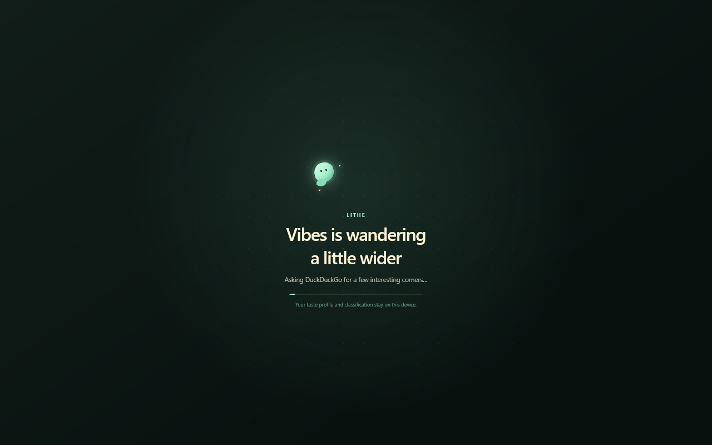

# Lithe Browser

Lithe is an experimental Gecko-based desktop browser focused on modern web
compatibility without treating spare RAM and CPU as a consumption target.


This repository is a compact, reproducible source overlay pinned to Firefox
revision `d4ae522db3b933e502d1febec899e7955c1fb633`. It contains every Lithe
modification and new source file without duplicating Mozilla's roughly
gigabyte-scale Git history.



## Current features

- Multi-tab Gecko browser with modern media playback
- DuckDuckGo as the default search engine
- Conservative content-process and memory policy
- Tracker, fingerprinting, query-stripping, and Global Privacy Control defaults
- Optional AI and tracker protection controls
- Vibes discovery in a dedicated tab
- 130-category, local website classification
- Pinned q8 BGE Small ONNX model with no hosted inference
- Three-second Vibes launch animation and offline discovery fallback
- Persistent retro-pixel Back, dislike, like, and Next controls in Vibes tabs
- A Lithe-specific About panel, release links, privacy information, and original
  bunny mascot

Vibes sends DuckDuckGo only generic category searches. It may pre-read up to
three result pages without cookies, scripts, or referrers, then ranks them
locally. Its interest profile is stored only in the browser profile and does
not read ordinary browsing history.

See [PRIVACY.md](PRIVACY.md) for the network and local-data boundaries, and
[BRANDING.md](BRANDING.md) for use of the Lithe name, logo, and mascot.

## Build on Windows

Install MozillaBuild, Git, and Python. Install the Hugging Face download CLI
used to reproduce the pinned model:

```powershell
python -m pip install huggingface_hub
```

Clone the upstream source and check out the pinned revision:

```powershell
git clone --filter=blob:none https://github.com/mozilla-firefox/firefox.git firefox-lithe
Set-Location firefox-lithe
git checkout d4ae522db3b933e502d1febec899e7955c1fb633
```

Apply the complete Lithe source overlay from this repository:

```powershell
& path\to\lithe-browser\scripts\apply-to-firefox.ps1 -FirefoxRoot $PWD
```

Then build from a MozillaBuild shell:

```bash
./mach build
./mach xpcshell-test browser/components/tests/unit/test_litheResourcePolicy.js
./mach marionette-test --app fxdesktop --allow-nonlocal-connections lithe_tests/test_lithe_youtube_media.py
```

Artifact builds reuse Mozilla's precompiled native launcher. Apply Lithe's
Windows icon after a successful artifact build:

```powershell
& .\lithe_tools\apply-windows-branding.ps1
```

## Repository layout

- `overlay/` contains new Lithe source and branding files at their Gecko paths.
- `patches/lithe.patch` contains changes to existing upstream files.
- `mozconfig.lithe` contains the artifact-build and Lithe-branding settings.
- `scripts/apply-to-firefox.ps1` validates and applies the complete overlay.
- `overlay/lithe_tools/fetch-vibes-model.ps1` downloads and verifies the model.

## Licensing and trademarks

The Lithe overlay is distributed under the Mozilla Public License 2.0. The
upstream Gecko source contains MPL-2.0 and other compatible third-party code;
retain its notices. The BGE Small model is separately distributed under the
MIT license and is documented in [THIRD_PARTY_NOTICES.md](THIRD_PARTY_NOTICES.md).

Lithe is not affiliated with or endorsed by Mozilla. Mozilla, Firefox, and
their logos are Mozilla trademarks and are not licensed by this repository.
References to Firefox identify the upstream source project only.

The cream-and-mint hipster bunny is an original Lithe character and does not
copy or represent Firefox, Mozilla, or another commercial character.

The Windows binaries are experimental alpha builds provided without warranty.
